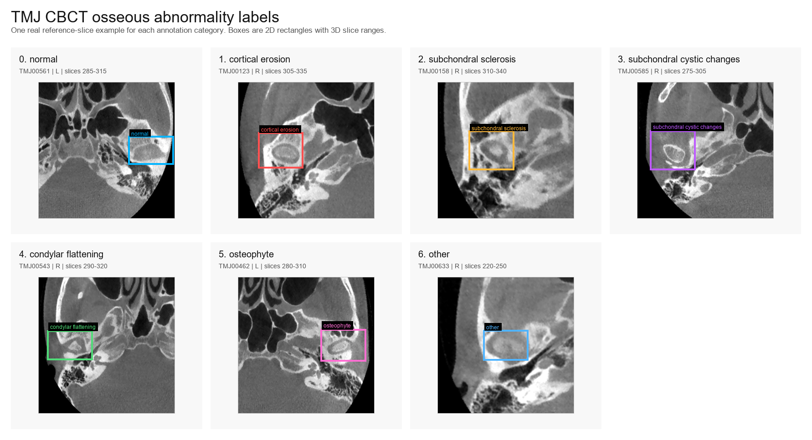

# TMJ-OD3D CBCT Dataset Utilities

This repository provides example code for reading and visualizing a TMJ CBCT dataset (https://www.scidb.cn/en/detail?dataSetId=216729be97a34b249d26da500bd5d9d9) with side-specific 3D bounding-box annotations of osseous abnormalities.

The code is intended to accompany a public dataset release. It shows how to connect three parts of the dataset:

- de-identified CBCT DICOM slices for each patient/sample;
- side-specific JSON annotation files, such as `L-label.json` and `R-label.json`;
- 3D bounding boxes represented as a 2D rectangle plus an axial DICOM slice range.



## Dataset Structure Expected By The Code

The scripts expect one folder per sample:

```text
TMJ CBCT Dataset/
  TMJ00001/
    file_....dcm
    file_....dcm
    L-label.json
    R-label.json
  TMJ00002/
    file_....dcm
    L-label.json
    R-label.json
```

Not every sample must have both side annotation files. The reader allows one-sided annotations and multiple boxes in one JSON file.

## Annotation Meaning

Each annotation shape is treated as one 3D bounding box:

```text
3D bounding box = 2D rectangle points + slice_start to slice_end
```

The label field is parsed as:

```text
<class_id(s)>-<side>-<slice_start>-<slice_end>
```

Examples:

- `4-L-295-325`: left TMJ, condylar flattening, visible from DICOM `InstanceNumber` 295 to 325.
- `1,5-R-240-270`: right TMJ, cortical erosion plus osteophyte, visible from 240 to 270.

Class names:

| ID | Class name |
| --- | --- |
| 0 | normal |
| 1 | cortical erosion |
| 2 | subchondral sclerosis |
| 3 | subchondral cystic changes |
| 4 | condylar flattening |
| 5 | osteophyte |
| 6 | other |

The code uses DICOM `InstanceNumber` as the authoritative axial slice identifier. It does not rely on directory listing order.

## Installation

Install the Python dependencies:

```bash
pip install -r requirements.txt
```

On the local development machine used for this dataset, the tested environment is:

```powershell
conda run -n base python ...
```

## Files In This Repository

| File | Purpose |
| --- | --- |
| `tmj_dataset_read_example.py` | Reads one sample and prints raw CBCT/DICOM information plus parsed annotation boxes. |
| `tmj_dataset_viewer.py` | Exports PNG images with bounding boxes drawn on reference or requested DICOM slices. |
| `make_label_examples_montage.py` | Creates a GitHub-ready montage with one real CBCT example for each label category. |
| `TMJ_DATASET_USAGE.md` | Short usage-focused guide with code snippets. |
| `test_tmj_dataset_viewer.py` | Unit and smoke tests for parsing, DICOM indexing, reading, and visualization. |
| `requirements.txt` | Minimal Python dependency list. |

## Example 1: Read One Sample

Run:

```powershell
conda run -n base python tmj_dataset_read_example.py `
  --dataset-root E:\tmj `
  --sample TMJ00622 `
  --side all `
  --output-json TMJ00622_summary.json
```

The command prints:

- sample ID and sample folder;
- number of DICOM slices;
- minimum and maximum DICOM `InstanceNumber`;
- raw CBCT pixel array shape, dtype, min, and max;
- one row per annotation box.

Example table columns:

```text
sample_id  side  class_id  class_name  slice_start  slice_end  reference_instance_number  bbox_xyxy  reference_dicom
```

The optional JSON output contains the same annotation information and raw pixel summaries for the referenced DICOM slices. This is useful when writing dataset loaders or verifying how the 3D bounding boxes map to image slices.

## Example 2: Visualize Annotation Reference Slices

Run:

```powershell
conda run -n base python tmj_dataset_viewer.py `
  --dataset-root E:\tmj `
  --sample TMJ00622 `
  --mode reference `
  --side all `
  --output-dir tmj_preview
```

This creates PNG files using each JSON file's `image_path` as the reference layer. Each image contains the CBCT slice and the corresponding annotation rectangle. Box labels are rendered with class names, side, and slice range.

Outputs:

```text
tmj_preview/
  TMJ00622_reference_file_....dcm.png
  render_manifest.csv
  validation_report.csv
```

## Example 3: Visualize A Specific DICOM Slice

Run:

```powershell
conda run -n base python tmj_dataset_viewer.py `
  --dataset-root E:\tmj `
  --sample TMJ00622 `
  --mode slice `
  --slice 315 `
  --side all `
  --output-dir tmj_preview
```

This draws only boxes whose 3D slice range contains DICOM `InstanceNumber` 315.

Use `--side L` or `--side R` to filter one TMJ side. Use `--class-filter 1,3,5` to draw only selected disease categories.

## Example 4: Create A GitHub Homepage Label Montage

Run:

```powershell
conda run -n base python make_label_examples_montage.py `
  --dataset-root E:\tmj `
  --output tmj_label_examples_montage.png `
  --manifest tmj_label_examples_manifest.csv `
  --seed 20260704
```

This creates one combined PNG with one real reference-slice example for each category `0-6`. The script prefers single-class annotations for each category and writes a CSV manifest recording the selected sample, side, slice range, reference DICOM, and bounding box.

The PNG is suitable for placing near the top of a GitHub README to show the dataset label categories.

## Output Files

`tmj_dataset_viewer.py` writes:

- PNG visualizations;
- `render_manifest.csv`, listing output paths, sample IDs, DICOM slices, and box counts;
- `validation_report.csv`, listing recoverable warnings or malformed records.

`tmj_dataset_read_example.py` optionally writes:

- a JSON summary with volume-level DICOM information and one record per annotation box.

`make_label_examples_montage.py` writes:

- one combined PNG label-category overview;
- an optional CSV manifest describing the examples used in the montage.

## Programmatic Use

The visualization script also exposes reusable functions:

```python
from pathlib import Path
from tmj_dataset_viewer import build_dicom_index, load_annotations

sample_dir = Path(r"E:\tmj\TMJ00622")
issues = []
dicom_index = build_dicom_index(sample_dir, issues)
boxes = load_annotations(sample_dir, issues)

for box in boxes:
    print(box.side, box.class_text, box.slice_start, box.slice_end, box.bbox_xyxy)
```

## Tests

Run:

```powershell
conda run -n base python -B -m unittest test_tmj_dataset_viewer.py
```

The tests cover:

- label parsing, including multi-class labels;
- missing-side and multi-box annotation cases;
- DICOM indexing by `InstanceNumber`;
- reading raw CBCT pixel summaries;
- PNG visualization output.

## Notes

- Pixel coordinates are `(x, y)`, where `x` is the image column and `y` is the image row.
- The rectangle is computed from the min and max of the two diagonal points stored in JSON.
- Raw CBCT means the original DICOM pixel array read by `pydicom`; visualization PNGs use windowing only for display.
- The code is designed for dataset access and verification, not for model training by itself.
